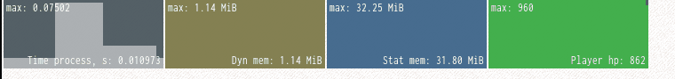
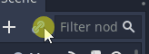

# Performance monitor node for Godot

Simple node for live monitoring of FPS, memory usage and such, loosely styled by Three.js's performance monitor.

Also has the ability to monitor passed object's chosen parameter.



It may have some performance overhead (not measured), but for FPS or memory monitoring it seems insignificant.

### Usage

- Copy PerfMonitor/ dir anywhere to your project

- Add scene PerfMonitor.tscn to your project's main scene 

- Setup what to monitor 

  - either inside PerfMonitor.gd _ready() function,  like 

    ```python
    func _ready():
    	add_perf_monitor(Performance.TIME_FPS, "FPS")
    ```

    the keys of built-in Performance enum are found here https://docs.godotengine.org/ru/stable/classes/class_performance.html

  - or in your code if you want to monitor your object's parameter. Object must be initialized before setting up plot, like

    ```python
    func _ready():
    	$PerfMonitor.add_custom_monitor($Player, "hitpoints", "Player hp")
    	# your $Player node must have "hitpoints" attribute, which must be either float or int
    ```

- Don't forget to add to .gitignore if you are using git something like

``` 
**/PerfMonitor/*
```

Also you can set plot size, color, or amount of plot stored data.  There are some commented examples PerfMonitor.gd

**Update**:

Added another kind of plot - funcref monitor which will call a function provided by passed FuncRef each frame. Example usage:

```python
    var render_info_funcref: FuncRef = funcref(VisualServer, "get_render_info")
	add_funcref_monitor(render_info_funcref, [VisualServer.INFO_TEXTURE_MEM_USED], 
		"Texture mem", Color(0.9, 0.9, 0.9, 0.6), true)
```

Only the first parameter to add_funcref_monitor (FuncRef itself ) is required, second parameter is Array of function call parameters, by default is empty. 

### Other notes

The draw call happens on _process, so update rate may be not constant.

The plot uses some kind of ring buffer based on PoolIntArray or PoolRealArray for storing data. 

There certainly are further optimizations, as I've wrote it during couple of night hours and then spent more time on making the gif in this readme.

What may be optimized (questionable):

- Not redraw plots every frame, but draw on texture, shift it and add one line each redraw
- ~~Make less checks every frame by subclassing custom plot and performance plot from base plot~~ Done
- Rewrite drawing with GDNative

